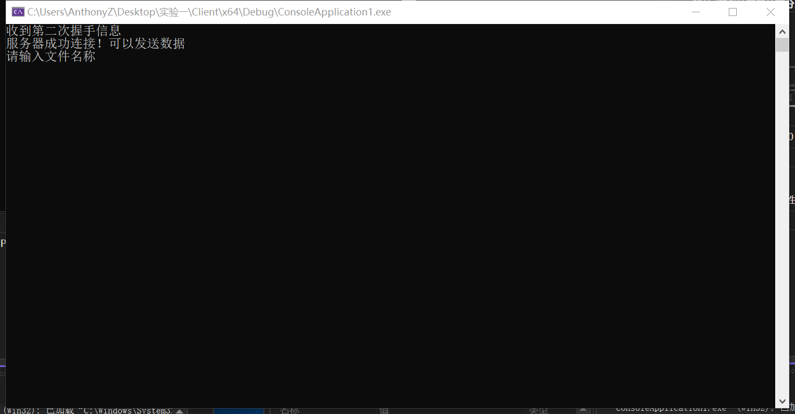

# 计算机网络大作业第一部分

> 朱浩泽 计算机科学与技术 1911530

## 实验要求

利用数据报套接字在用户空间实现面向连接的可靠数据传输，功能包括：建立连接、差错检测、确认重传等。流量控制采用停等机制，完成给定测试文件的传输。

## 实验设计

### 实验原理

##### 1. 超时重传

超时重传指的是在发送数据报文段后开始计时，到等待确认应答到来的那个时间间隔。如果超过这个时间间隔，仍未收到确认应答，发送端将进行数据重传。

##### 2. UDP

UDP是User Datagram Protocol的简称,中文名是用户数据报协议,是OSI参考模型中的传输层协议,它是一种无连接的传输层协议,提供面向事务的简单不可靠信息传送服务。

### 协议设计

##### 1. 报文格式


报文头长度为48位

前16位为数据长度，用于记录数据区的大小

17-32位为校验和，用于检验传输的正确性

33-40位为标志位，只使用低3位，分别为FIN，ACK，SYN

40-48位为传输的数据包的序号，0-255循环使用

##### 2. 连接与断开

- 三次握手进行连接

  首先，客户端向服务端发送数据包，其中SYN=1，ACK=0，FIN=0

  服务端接受到数据包后，向客户端发送SYN=0，ACK=1，FIN=0

  客户端再次接收到数据包后，向服务端发送SYN=1，ACK=1，FIN=0

  服务端接收到数据包后，连接成功建立，可以进行数据传输

- 四次挥手断开连接

  首先，客户端向服务端发送数据包，其中SYN=0，ACK=0，FIN=1

  服务端接受到数据包后，向客户端发送SYN=0，ACK=1，FIN=0

  客户端再次接收到数据包后，向服务端发送SYN=0，ACK=1，FIN=1

  服务端接收到数据包后，向客户端发送SYN=0，ACK=1，FIN=1

  客户端接收到数据包后，连接成功断开

##### 3.数据传输

发送端和接收端的接收机均采用rdt3.0


数据在传输时，讲一个文件分为数个包进行分段传输，每个包的内容为数据头+数据

在传输时，需要接受到上一个发送包序号的ACK=1才能发送下一个数据包；接收端接收到了一个数据包，先要进行校验，如果检查无误，则向发送放返回该序列号的ACK=1


在一定时间内，如果没有收到该序列号的ACK=1，将会重新传输该包


如果接收端收到了重复的包裹，则将其中一个丢弃，但仍需要向发送方发送该序列号的ACK=1

在最后，发送方需要向接收端发送一个FIN=1， ACK=1，SYN=1的包裹，表示文件传输结束；接收端收到该包裹后，需要向发送方返回一个ACK=1，表示收到文件传输结束的信号。

## 代码实现

### 计算校验和

- 发送方生成检验和
  1. 将发送的进行检验和运算的数据分成若干个16位的位串，每个位串看成一个二进制数
  2. 将首部中的检验和字段置为0，该字段也参与检验和运算。
  3. 对这些16位的二进制数进行1的补码和运算，累加的结果再取反码即生成了检验码。将检验码放入检验和字段中。其中1的补码和运算，即带循环进位的加法，最高位有进位应循环进到最低位

- 接收方校验检验和
  1. 接收方将接收的数据(包括检验和字段)按发送方的同样的方法进行1的补码和运算，累加的结果再取反码。
  2. 校验，如果上步的结果为0，表示传输正确；否则，说明传输有差错。

```c++
u_short cksum(u_short* mes, int size) {
    int count = (size + 1) / 2;
    u_short* buf = (u_short*)malloc(size + 1);
    memset(buf, 0, size + 1);
    memcpy(buf, mes, size);
    u_long sum = 0;
    while (count--) {
        sum += *buf++;
        if (sum & 0xffff0000) {
            sum &= 0xffff;
            sum++;
        }
    }
    return ~(sum & 0xffff);
}
```

### 数据头和标志位定义

```c++
const int MAXSIZE = 1024;//传输缓冲区最大长度
const unsigned char SYN = 0x1; //SYN = 1 ACK = 0
const unsigned char ACK = 0x2;//SYN = 0, ACK = 1
const unsigned char ACK_SYN = 0x3;//SYN = 1, ACK = 1
const unsigned char FIN = 0x4;//FIN = 1 ACK = 0
const unsigned char FIN_ACK = 0x5;//FIN = 1 ACK = 0
const unsigned char OVER = 0x7;//结束标志
double MAX_TIME = 0.5 * CLOCKS_PER_SEC;

struct HEADER
{
    u_short sum = 0;//校验和 16位
    u_short datasize = 0;//所包含数据长度 16位
    unsigned char flag = 0;
    //八位，使用后三位，排列是FIN ACK SYN 
    unsigned char SEQ = 0;
    //八位，传输的序列号，0~255，超过后mod
    HEADER() {
        sum = 0;//校验和 16位
        datasize = 0;//所包含数据长度 16位
        flag = 0;
        //八位，使用后三位，排列是FIN ACK SYN 
        SEQ = 0;
    }
};
```

### 三次握手

- 客户端

  ```c++
  int Connect(SOCKET& sockServ, SOCKADDR_IN& ClientAddr, int& ClientAddrLen)
  {
      
      HEADER header;
      char* Buffer = new char[sizeof(header)];
  
      //接收第一次握手信息
      while (1 == 1)
      {
          if (recvfrom(sockServ, Buffer, sizeof(header), 0, (sockaddr*)&ClientAddr, &ClientAddrLen) == -1) 
          {
              return -1;
          }
          memcpy(&header, Buffer, sizeof(header));
          if (header.flag == SYN && cksum((u_short*)&header, sizeof(header)) == 0)
          {
              cout << "成功接收第一次握手信息" << endl;
              break;
          }
      }
  
      //发送第二次握手信息
      header.flag = ACK;
      header.sum = 0;
      u_short temp = cksum((u_short*)&header, sizeof(header));
      header.sum = temp;
      memcpy(Buffer, &header, sizeof(header));
      if (sendto(sockServ, Buffer, sizeof(header), 0, (sockaddr*)&ClientAddr, ClientAddrLen) == -1)
      {
          return -1;
      }
      clock_t start = clock();//记录第二次握手发送时间
  
      //接收第三次握手
      while (recvfrom(sockServ, Buffer, sizeof(header), 0, (sockaddr*)&ClientAddr, &ClientAddrLen) <= 0)
      {
          if (clock() - start > MAX_TIME)
          {
              header.flag = ACK;
              header.sum = 0;
              u_short temp = cksum((u_short*)&header, sizeof(header));
              header.flag = temp;
              memcpy(Buffer, &header, sizeof(header));
              if (sendto(sockServ, Buffer, sizeof(header), 0, (sockaddr*)&ClientAddr, ClientAddrLen) == -1)
              {
                  return -1;
              }
              cout << "第二次握手超时，正在进行重传" << endl;
          }
      }
  
      HEADER temp1;
      memcpy(&temp1, Buffer, sizeof(header));
      if (temp1.flag == ACK_SYN && cksum((u_short*)&temp1, sizeof(temp1) == 0))
      {
          cout << "成功建立通信！可以接收数据" << endl;
      }
      else
      {
          cout << "serve连接发生错误，请重启客户端！" << endl;
          return -1;
      }
      return 1;
  }
  ```

- 服务端

  ```c++
  int Connect(SOCKET& socketClient, SOCKADDR_IN &servAddr, int& servAddrlen)//三次握手建立连接
  {
      HEADER header;
      char* Buffer = new char[sizeof(header)];
  
      u_short sum;
  
      //进行第一次握手
      header.flag = SYN;
      header.sum = 0;//校验和置0
      u_short temp = cksum((u_short*)&header, sizeof(header));
      header.sum = temp;//计算校验和
      memcpy(Buffer, &header, sizeof(header));//将首部放入缓冲区
      if (sendto(socketClient, Buffer, sizeof(header), 0, (sockaddr*)&servAddr, servAddrlen) == -1)
      {
          return -1;
      }
      clock_t start = clock(); //记录发送第一次握手时间
  
      u_long mode = 1;
      ioctlsocket(socketClient, FIONBIO, &mode);
  
      //接收第二次握手
      while (recvfrom(socketClient, Buffer, sizeof(header), 0, (sockaddr*)&servAddr, &servAddrlen) <= 0)
      {
          if (clock() - start > MAX_TIME)//超时，重新传输第一次握手
          {
              header.flag = SYN;
              header.sum = 0;//校验和置0
              header.sum = cksum((u_short*)&header, sizeof(header));//计算校验和
              memcpy(Buffer, &header, sizeof(header));//将首部放入缓冲区
              sendto(socketClient, Buffer, sizeof(header), 0, (sockaddr*)&servAddr, servAddrlen);
              start = clock();
              cout << "第一次握手超时，正在进行重传" << endl;
          }
      }
  
      
      //进行校验和检验
      memcpy(&header, Buffer, sizeof(header));
      if (header.flag == ACK && cksum((u_short*)&header, sizeof(header) == 0))
      {
          cout << "收到第二次握手信息" << endl;
      }
      else
      {
          cout << "连接发生错误，请重启客户端！" << endl;
          return - 1;
      }
  
      //进行第三次握手
      header.flag = ACK_SYN;
      header.sum = 0;
      header.sum = cksum((u_short*)&header, sizeof(header));//计算校验和
      if (sendto(socketClient, (char*) & header, sizeof(header), 0, (sockaddr*)&servAddr, servAddrlen) == -1)
      {
          return -1;//判断客户端是否打开，-1为未开启发送失败
      }
      cout << "服务器成功连接！可以发送数据" << endl;
      return 1;
  }
  ```

### 传输数据

- 发送单个数据包

  ```c++
  void send_package(SOCKET& socketClient, SOCKADDR_IN& servAddr, int& servAddrlen, char* message, int len, int &order)
  {
      HEADER header;
      char* buffer = new char[MAXSIZE + sizeof(header)];
      header.datasize = len;
      header.SEQ = unsigned char(order);//序列号
      memcpy(buffer, &header, sizeof(header));
      memcpy(buffer + sizeof(header), message, sizeof(header) + len);
      u_short check = cksum((u_short *) buffer, sizeof(header) + len);//计算校验和
      header.sum = check;
      memcpy(buffer, &header, sizeof(header));
      sendto(socketClient, buffer, len + sizeof(header), 0, (sockaddr*)&servAddr, servAddrlen);//发送
      cout << "Send message " << len << " bytes!" << " flag:" << int(header.flag) << " SEQ:" << int(header.SEQ) << " SUM:" << int(header.sum) << endl;
      clock_t start = clock();//记录发送时间
      //接收ack等信息
      while (1 == 1)
      {
          u_long mode = 1;
          ioctlsocket(socketClient, FIONBIO, &mode);
          while (recvfrom(socketClient, buffer, MAXSIZE, 0, (sockaddr*)&servAddr, &servAddrlen) <= 0)
          {
              if (clock() - start > MAX_TIME)
              {
                  header.datasize = len;
                  header.SEQ = u_char(order);//序列号
                  header.flag = u_char(0x0);
                  memcpy(buffer, &header, sizeof(header));
                  memcpy(buffer + sizeof(header), message, sizeof(header) + len);
                  u_short check = cksum((u_short*)buffer, sizeof(header) + len);//计算校验和
                  header.sum = check;
                  memcpy(buffer, &header, sizeof(header));
                  sendto(socketClient, buffer, len + sizeof(header), 0, (sockaddr*)&servAddr, servAddrlen);//发送
                  cout << "TIME OUT! ReSend message " << len << " bytes! Flag:" << int(header.flag) << " SEQ:" << int(header.SEQ) << endl;
                  clock_t start = clock();//记录发送时间
              }
          }
          memcpy(&header, buffer, sizeof(header));//缓冲区接收到信息，读取
          u_short check = cksum((u_short*)&header, sizeof(header));
          if (header.SEQ == u_short(order) && header.flag == ACK)
          {
              cout << "Send has been confirmed! Flag:" << int(header.flag)<< " SEQ:" << int(header.SEQ) << endl;
              break;
          }
          else
          {
              continue;
          }
      }
      u_long mode = 0;
      ioctlsocket(socketClient, FIONBIO, &mode);//改回阻塞模式
  }
  
  ```

- 发送文件以及结束标志

  ```c++
  void send(SOCKET& socketClient, SOCKADDR_IN& servAddr, int& servAddrlen, char* message, int len)
  {
      int packagenum = len / MAXSIZE + (len % MAXSIZE != 0);
      int seqnum = 0;
      for (int i = 0; i < packagenum; i++)
      {
          send_package(socketClient, servAddr, servAddrlen, message + i * MAXSIZE, i == packagenum - 1? len - (packagenum - 1) * MAXSIZE : MAXSIZE, seqnum);
          seqnum++;
          if (seqnum > 255)
          {
              seqnum = seqnum - 256;
          }
      }
      //发送结束信息
      HEADER header;
      char* Buffer = new char[sizeof(header)];
      header.flag = OVER;
      header.sum = 0;
      u_short temp = cksum((u_short*)&header, sizeof(header));
      header.sum = temp;
      memcpy(Buffer, &header, sizeof(header));
      sendto(socketClient, Buffer, sizeof(header), 0, (sockaddr*)&servAddr, servAddrlen);
      cout << "Send End!" << endl;
      clock_t start = clock();
      while (1 == 1)
      {
          u_long mode = 1;
          ioctlsocket(socketClient, FIONBIO, &mode);
          while (recvfrom(socketClient, Buffer, MAXSIZE, 0, (sockaddr*)&servAddr, &servAddrlen) <= 0)
          {
              if (clock() - start > MAX_TIME)
              {
                  char* Buffer = new char[sizeof(header)];
                  header.flag = OVER;
                  header.sum = 0;
                  u_short temp = cksum((u_short*)&header, sizeof(header));
                  header.sum = temp;
                  memcpy(Buffer, &header, sizeof(header));
                  sendto(socketClient, Buffer, sizeof(header), 0, (sockaddr*)&servAddr, servAddrlen);
                  cout << "Time Out! ReSend End!" << endl;
                  start = clock();
              }
          }
          memcpy(&header, Buffer, sizeof(header));//缓冲区接收到信息，读取
          u_short check = cksum((u_short*)&header, sizeof(header));
          if (header.flag == OVER)
          {
              cout << "对方已成功接收文件!" << endl;
              break;
          }
          else
          {
              continue;
          }
      }
      u_long mode = 0;
      ioctlsocket(socketClient, FIONBIO, &mode);//改回阻塞模式
  }
  ```

### 接收数据

```c++
int RecvMessage(SOCKET& sockServ, SOCKADDR_IN& ClientAddr, int& ClientAddrLen, char *message)
{
    long int all = 0;//文件长度
    HEADER header;
    char* Buffer = new char[MAXSIZE + sizeof(header)];
    int seq = 0;
    int index = 0;

    while (1 == 1)
    {
        int length = recvfrom(sockServ, Buffer, sizeof(header) + MAXSIZE, 0, (sockaddr*)&ClientAddr, &ClientAddrLen);//接收报文长度
        //cout << length << endl;
        memcpy(&header, Buffer, sizeof(header));
        //判断是否是结束
        if (header.flag == OVER && cksum((u_short*)&header, sizeof(header)) == 0)
        {
            cout << "文件接收完毕" << endl;
            break;
        }
        if (header.flag == unsigned char(0) && cksum((u_short*)Buffer, length - sizeof(header)))
        {
            //判断是否接受的是别的包
            if (seq != int(header.SEQ))
            {
                //说明出了问题，返回ACK
                header.flag = ACK;
                header.datasize = 0;
                header.SEQ = (unsigned char)seq;
                header.sum = 0;
                u_short temp = cksum((u_short*)&header, sizeof(header));
                header.sum = temp;
                memcpy(Buffer, &header, sizeof(header));
                //重发该包的ACK
                sendto(sockServ, Buffer, sizeof(header), 0, (sockaddr*)&ClientAddr, ClientAddrLen);
                cout << "Send to Clinet ACK:" << (int)header.SEQ << " SEQ:" << (int)header.SEQ << endl;
                continue;//丢弃该数据包
            }
            seq = int(header.SEQ);
            if (seq > 255)
            {
                seq = seq - 256;
            }
            //取出buffer中的内容
            cout << "Send message " << length - sizeof(header) << " bytes!Flag:" << int(header.flag) << " SEQ : " << int(header.SEQ) << " SUM:" << int(header.sum) << endl;
            char* temp = new char[length - sizeof(header)];
            memcpy(temp, Buffer + sizeof(header), length - sizeof(header));
            //cout << "size" << sizeof(message) << endl;
            memcpy(message + all, temp, length - sizeof(header));
            all = all + int(header.datasize);

            //返回ACK
            header.flag = ACK;
            header.datasize = 0;
            header.SEQ = (unsigned char)seq;
            header.sum = 0;
            u_short temp1 = cksum((u_short*)&header, sizeof(header));
            header.sum = temp1;
            memcpy(Buffer, &header, sizeof(header));
            //重发该包的ACK
            sendto(sockServ, Buffer, sizeof(header), 0, (sockaddr*)&ClientAddr, ClientAddrLen);
            cout << "Send to Clinet ACK:" << (int)header.SEQ << " SEQ:" << (int)header.SEQ << endl;
            seq++;
            if (seq > 255)
            {
                seq = seq - 256;
            }
        }
    }
    //发送OVER信息
    header.flag = OVER;
    header.sum = 0;
    u_short temp = cksum((u_short*)&header, sizeof(header));
    header.sum = temp;
    memcpy(Buffer, &header, sizeof(header));
    if (sendto(sockServ, Buffer, sizeof(header), 0, (sockaddr*)&ClientAddr, ClientAddrLen) == -1)
    {
        return -1;
    }
    return all;
}
```

### 四次挥手

- 客户端

  ```c++
  int disConnect(SOCKET& socketClient, SOCKADDR_IN& servAddr, int& servAddrlen)
  {
      HEADER header;
      char* Buffer = new char[sizeof(header)];
  
      u_short sum;
  
      //进行第一次挥手
      header.flag = FIN;
      header.sum = 0;//校验和置0
      u_short temp = cksum((u_short*)&header, sizeof(header));
      header.sum = temp;//计算校验和
      memcpy(Buffer, &header, sizeof(header));//将首部放入缓冲区
      if (sendto(socketClient, Buffer, sizeof(header), 0, (sockaddr*)&servAddr, servAddrlen) == -1)
      {
          return -1;
      }
      clock_t start = clock(); //记录发送第一次挥手时间
  
      u_long mode = 1;
      ioctlsocket(socketClient, FIONBIO, &mode);
  
      //接收第二次挥手
      while (recvfrom(socketClient, Buffer, sizeof(header), 0, (sockaddr*)&servAddr, &servAddrlen) <= 0)
      {
          if (clock() - start > MAX_TIME)//超时，重新传输第一次挥手
          {
              header.flag = FIN;
              header.sum = 0;//校验和置0
              header.sum = cksum((u_short*)&header, sizeof(header));//计算校验和
              memcpy(Buffer, &header, sizeof(header));//将首部放入缓冲区
              sendto(socketClient, Buffer, sizeof(header), 0, (sockaddr*)&servAddr, servAddrlen);
              start = clock();
              cout << "第一次挥手超时，正在进行重传" << endl;
          }
      }
  
  
      //进行校验和检验
      memcpy(&header, Buffer, sizeof(header));
      if (header.flag == ACK && cksum((u_short*)&header, sizeof(header) == 0))
      {
          cout << "收到第二次挥手信息" << endl;
      }
      else
      {
          cout << "连接发生错误，程序直接退出！" << endl;
          return -1;
      }
  
      //进行第三次挥手
      header.flag = FIN_ACK;
      header.sum = 0;
      header.sum = cksum((u_short*)&header, sizeof(header));//计算校验和
      if (sendto(socketClient, (char*)&header, sizeof(header), 0, (sockaddr*)&servAddr, servAddrlen) == -1)
      {
          return -1;
      }
  
      start = clock();
      //接收第四次挥手
      while (recvfrom(socketClient, Buffer, sizeof(header), 0, (sockaddr*)&servAddr, &servAddrlen) <= 0)
      {
          if (clock() - start > MAX_TIME)//超时，重新传输第三次挥手
          {
              header.flag = FIN;
              header.sum = 0;//校验和置0
              header.sum = cksum((u_short*)&header, sizeof(header));//计算校验和
              memcpy(Buffer, &header, sizeof(header));//将首部放入缓冲区
              sendto(socketClient, Buffer, sizeof(header), 0, (sockaddr*)&servAddr, servAddrlen);
              start = clock();
              cout << "第四次握手超时，正在进行重传" << endl;
          }
      }
      cout << "四次挥手结束，连接断开！" << endl;
      return 1;
  }
  ```

- 服务端

  ```c++
  int disConnect(SOCKET& sockServ, SOCKADDR_IN& ClientAddr, int& ClientAddrLen)
  {
      HEADER header;
      char* Buffer = new char [sizeof(header)];
      while (1 == 1) 
      {
          int length = recvfrom(sockServ, Buffer, sizeof(header) + MAXSIZE, 0, (sockaddr*)&ClientAddr, &ClientAddrLen);//接收报文长度
          memcpy(&header, Buffer, sizeof(header));
          if (header.flag == FIN && cksum((u_short*)&header, sizeof(header)) == 0)
          {
              cout << "成功接收第一次挥手信息" << endl;
              break;
          }
      }
      //发送第二次挥手信息
      header.flag = ACK;
      header.sum = 0;
      u_short temp = cksum((u_short*)&header, sizeof(header));
      header.sum = temp;
      memcpy(Buffer, &header, sizeof(header));
      if (sendto(sockServ, Buffer, sizeof(header), 0, (sockaddr*)&ClientAddr, ClientAddrLen) == -1)
      {
          return -1;
      }
      clock_t start = clock();//记录第二次挥手发送时间
  
      //接收第三次挥手
      while (recvfrom(sockServ, Buffer, sizeof(header), 0, (sockaddr*)&ClientAddr, &ClientAddrLen) <= 0)
      {
          if (clock() - start > MAX_TIME)
          {
              header.flag = ACK;
              header.sum = 0;
              u_short temp = cksum((u_short*)&header, sizeof(header));
              header.flag = temp;
              memcpy(Buffer, &header, sizeof(header));
              if (sendto(sockServ, Buffer, sizeof(header), 0, (sockaddr*)&ClientAddr, ClientAddrLen) == -1)
              {
                  return -1;
              }
              cout << "第二次挥手超时，正在进行重传" << endl;
          }
      }
  
      HEADER temp1;
      memcpy(&temp1, Buffer, sizeof(header));
      if (temp1.flag == FIN_ACK && cksum((u_short*)&temp1, sizeof(temp1) == 0))
      {
          cout << "成功接收第三次挥手" << endl;
      }
      else
      {
          cout << "发生错误,客户端关闭！" << endl;
          return -1;
      }
  
      //发送第四次挥手信息
      header.flag = FIN_ACK;
      header.sum = 0;
      temp = cksum((u_short*)&header, sizeof(header));
      header.sum = temp;
      memcpy(Buffer, &header, sizeof(header));
      if (sendto(sockServ, Buffer, sizeof(header), 0, (sockaddr*)&ClientAddr, ClientAddrLen) == -1)
      {
          cout << "发生错误,客户端关闭！" << endl;
          return -1;
      }
      cout << "四次挥手结束，连接断开！" << endl;
      return 1;
  }
  ```

## 实验结果展示

### 三次挥手建立连接




### 传输数据和断开连接


### 传输结果展示


与原图大小、信息完全相同，传输成功！


