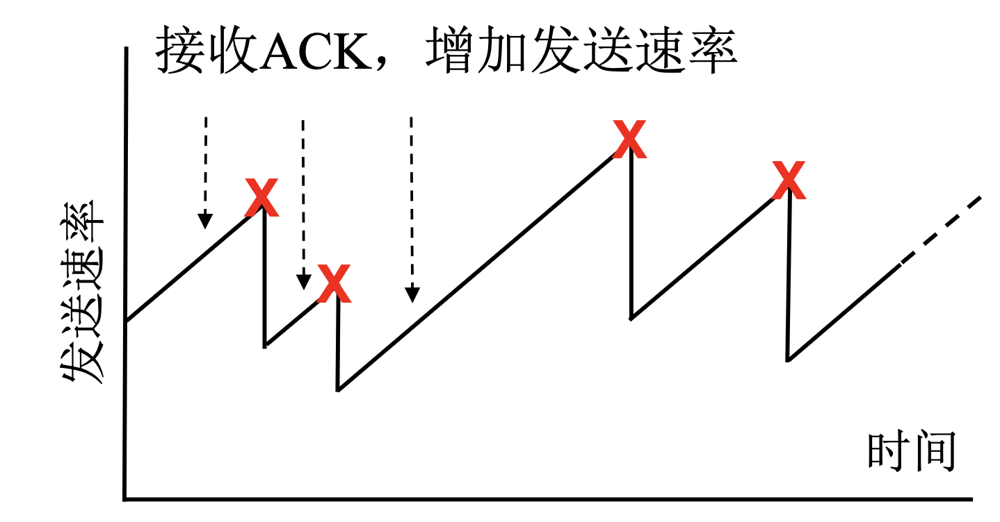
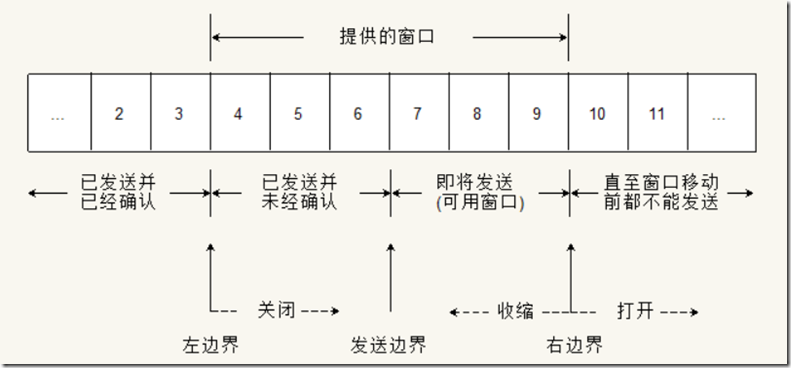
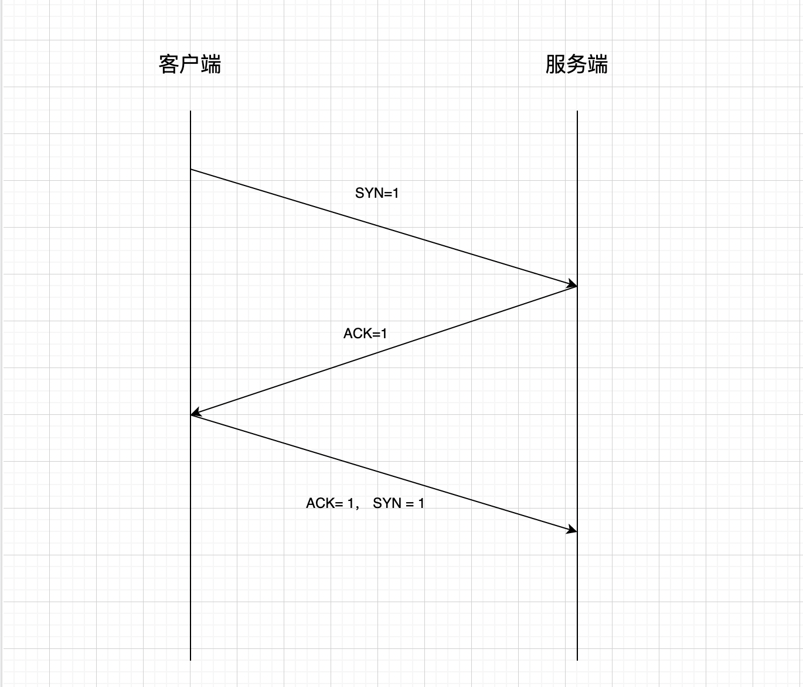
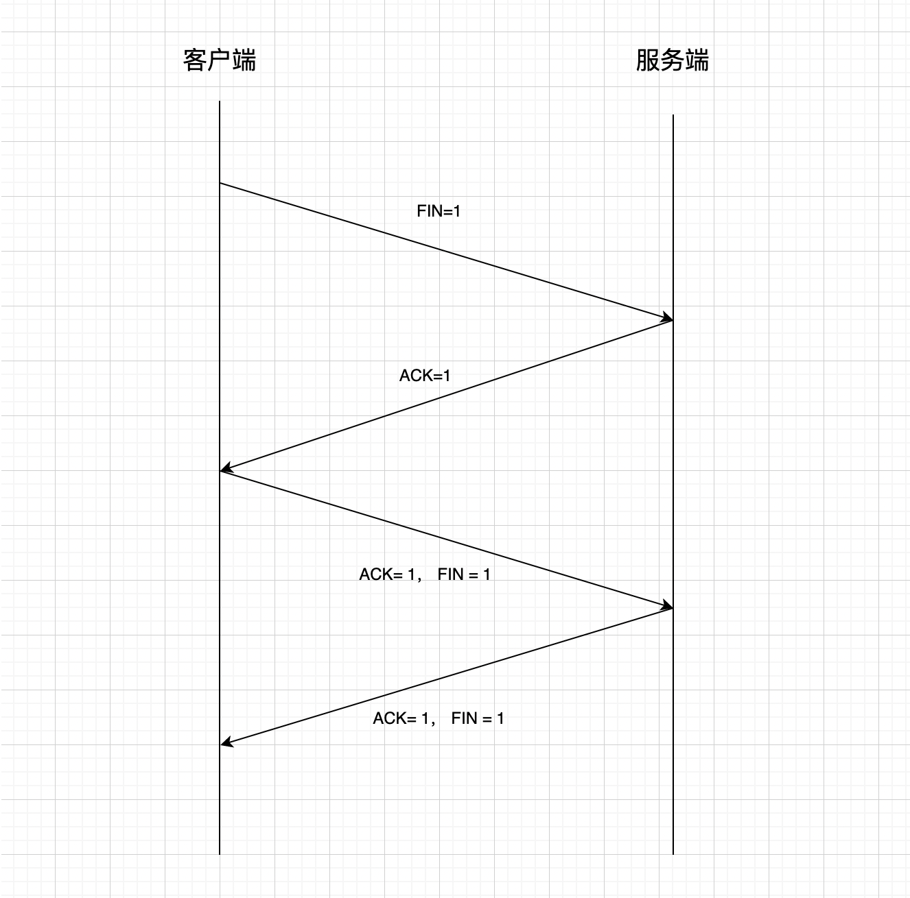
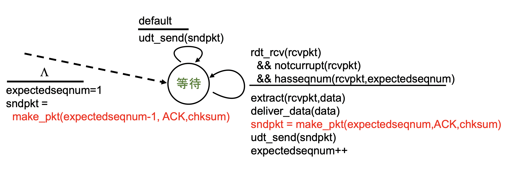
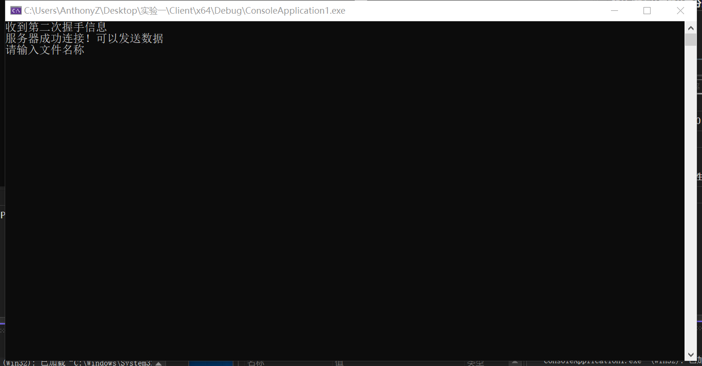
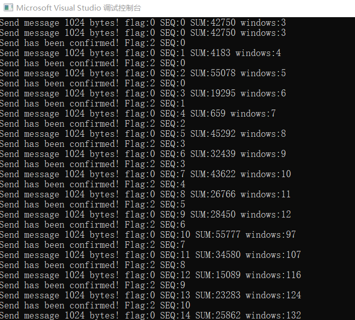
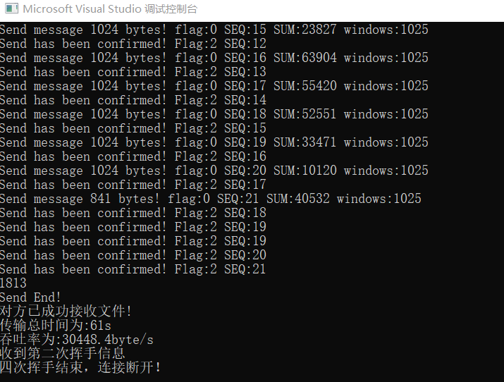
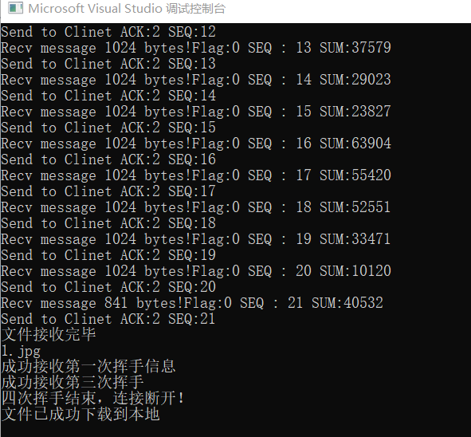
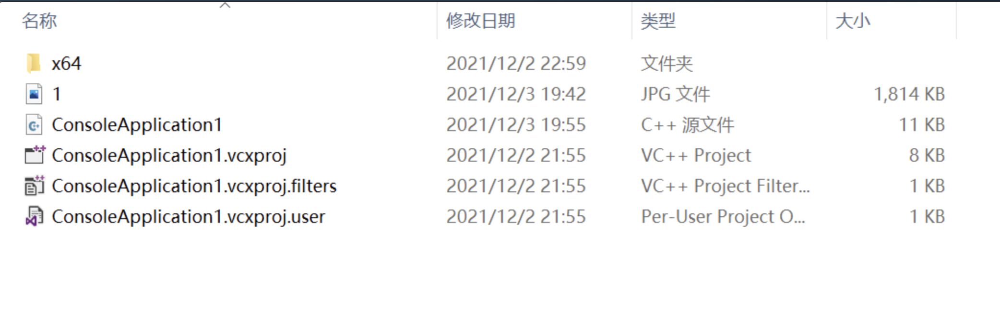

# 计算机网络大作业第三部分

> 朱浩泽 计算机科学与技术 1911530

## 实验要求

在实验3-2的基础上，选择实现一种拥塞控制算法，也可以是改进的算法，完成给定测试文件的传输。

## 实验设计

### 实验原理

##### 1. UDP

UDP是User Datagram Protocol的简称,中文名是用户数据报协议,是OSI参考模型中的传输层协议,它是一种无连接的传输层协议,提供面向事务的简单不可靠信息传送服务。

##### 2. 流水线协议

在确认未返回之前允许发送多个分组

##### 3. 网络拥塞

主机发送的数据过多或过快，造成网络中的路由器(或其他设备)无法及时处理，从而引入时延或丢弃。

##### 4. 拥塞控制

在某段时间，若对网络中某一资源的需求超过了该资源所能提供的可用部分，网络性能就要变坏，这种情况就叫做网络拥塞。在计算机网络中数位链路容量（即带宽）、交换结点中的缓存和处理机等，都是网络的资源。若出现拥塞而不进行控制，整个网络的吞吐量将随输入负荷的增大而下降。

目标：既不造成网络严重拥塞，又能更快地传输数据 

带宽探测：接收到ACK，高传输速率；发生丢失事件，降低传输速率

ACK返回：说明网络并未拥塞，可以继续提高发送速率 

丢失事件：假设所有丢失是由于拥塞造成的，降低发送速率

##### 5. 拥塞窗口

发送方维持一个拥塞窗口 cwnd 的状态变量。拥塞窗口的大小取决于网络的拥塞程度，并且动态地在变化。

发送方控制拥塞窗口的原则是：只要网络没有出现拥塞，拥塞窗口就再增大一些，以便把更多的分组发送出去。但只要网络出现拥塞，拥塞窗口就减小一些，以减少注入到网络中的分组数。

慢开始算法：当主机开始发送数据时，如果立即所大量数据字节注入到网络，那么就有可能引起网络拥塞，因为现在并不清楚网络的负荷情况。因此，较好的方法是 先探测一下，即由小到大逐渐增大发送窗口，也就是说，由小到大逐渐增大拥塞窗口数值。通常在刚刚开始发送报文段时，先把拥塞窗口 cwnd 设置为一个最大报文段MSS的数值。而在每收到一个对新的报文段的确认后，把拥塞窗口增加至多一个MSS的数值。用这样的方法逐步增大发送方的拥塞窗口 cwnd ，可以使分组注入到网络的速率更加合理。

拥塞避免算法：让拥塞窗口cwnd缓慢地增大，拥塞窗口cwnd按线性规律缓慢增长，比慢开始算法的拥塞窗口增长速率缓慢得多。

无论在慢开始阶段还是在拥塞避免阶段，只要发送方判断网络出现拥塞（其根据就是没有收到确认），就要把慢开始门限ssthresh设置为出现拥塞时的发送方窗口值的一半。然后把拥塞窗口cwnd重新设置为1，执行慢开始算法，要迅速减少主机发送到网络中的分组数，使得发生拥塞的路由器有足够时间把队列中积压的分组处理完毕。

### 协议设计

##### 1. 报文格式


报文头长度为48位

前16位为数据长度，用于记录数据区的大小

17-32位为校验和，用于检验传输的正确性

33-40位为标志位，只使用低3位，分别为FIN，ACK，SYN

40-48位为传输的数据包的序号，0-255循环使用

##### 2. 拥塞控制窗口

采用基于窗口的方法，通过拥塞窗口的增大或减小控制发送速率，窗口结构如下



窗口（称为cwnd）分为左边界、发送边界和右边界，窗口大小变化。窗口左边界左侧为已经发送并得到确认的数据，左边界到发送边界的数据为已发送但未得到确认的数据，发送边界到右边界为等待发送的数据，右边界右侧为不可发送的数据。

设定一个慢开始门限，记为ssthresh，令其初始值为12；令最初的窗口大小cwnd为1

如果cwnd的值小于开始门限的阈值，则处于慢开始阶段；否则处于拥塞避免阶段

- 慢开始阶段：
  1. 每个RTT，cwnd自增1
  2. 每接收到一个ACK，cwnd自增1
  3. 当cwnd超过慢开始门限阈值时，进入拥塞避免阶段
- 拥塞避免阶段
  1. 每接收到一个ACK，$cwnd = cwnd + MSS *\frac{MSS}{cwnd} $
  2. 如果重复接收到两个相同的ACK，门限阈值$ssthresh = cwnd \div 2$ ，窗口大小$cwnd = ssthresh + 3$
  3. 如果目前缓冲区中的未确认的报文数量大于等于10个，则门限阈值$ssthresh = cwnd \div 2$ ，窗口大小$cwnd = ssthresh + 3$
  4. 如果一个报文接收ACK超时，则门限阈值$ssthresh = cwnd \div 2$，窗口大小 $cwnd = 1$，进入慢开始阶段

##### 3. 连接与断开

- 三次握手进行连接

  首先，客户端向服务端发送数据包，其中SYN=1，ACK=0，FIN=0

  服务端接受到数据包后，向客户端发送SYN=0，ACK=1，FIN=0

  客户端再次接收到数据包后，向服务端发送SYN=1，ACK=1，FIN=0

  服务端接收到数据包后，连接成功建立，可以进行数据传输

- 四次挥手断开连接

  首先，客户端向服务端发送数据包，其中SYN=0，ACK=0，FIN=1

  服务端接受到数据包后，向客户端发送SYN=0，ACK=1，FIN=0

  客户端再次接收到数据包后，向服务端发送SYN=0，ACK=1，FIN=1

  服务端接收到数据包后，向客户端发送SYN=0，ACK=1，FIN=1

  客户端接收到数据包后，连接成功断开

##### 4. 数据传输

接收端的接收机采用GBN

数据在传输时，将一个文件分为数个包进行分段传输，每个包的内容为数据头+数据

在最初，发送端处于慢启动阶段，经过一段时间后窗口大小大于门限阈值，进入拥塞控制阶段

在传输时，无需接受到上一个发送包序号的ACK=1才能发送下一个数据包，可以继续发送直到窗口大小数量的数据包；接收端接收到了一个数据包，先要进行校验，如果检查无误，则向发送放返回该序列号的ACK=1，发送端接收到该ACK后调整窗口大小

在一定时间内，如果没有收到某一已经传输的报文的正确的ACK，则将窗口中所有位于该数据包后已经传输但未得到确认的数据包丢弃，并从该数据包开始进行重传，发送端再次进入慢启动阶段，门限阈值进行调整；如果再次接收到了已经确认的报文的ACK，则忽略；如果连续接收到了相同的ACK或窗口中未确认的报文多于一定数目，则调整窗口大小和门限阈值

如果接收端收到了重复的包裹，则将其中一个丢弃，但仍需要向发送方发送该序列号的ACK=1

在最后，发送方需要向接收端发送一个FIN=1， ACK=1，SYN=1的包裹，表示文件传输结束；接收端收到该包裹后，需要向发送方返回一个ACK=1，表示收到文件传输结束的信号

## 核心代码实现（其余与实验一相同）

### 数据头和标志位定义

```c++
const int MAXSIZE = 1024;//传输缓冲区最大长度
const unsigned char SYN = 0x1; //SYN = 1 ACK = 0
const unsigned char ACK = 0x2;//SYN = 0, ACK = 1，FIN = 0
const unsigned char ACK_SYN = 0x3;//SYN = 1, ACK = 1
const unsigned char FIN = 0x4;//FIN = 1 ACK = 0
const unsigned char FIN_ACK = 0x5;
const unsigned char OVER = 0x7;//结束标志
double MAX_TIME = 0.5 * CLOCKS_PER_SEC;
int windows = 2; //初始窗口大小
int state = 0; //0为慢启动阶段，1为拥塞避免阶段
int ssthresh = 12;//阈值
int sum = 0;

struct HEADER
{
    u_short sum = 0;//校验和 16位
    u_short datasize = 0;//所包含数据长度 16位
    unsigned char flag = 0;
    //八位，使用后四位，排列是FIN ACK SYN 
    unsigned char SEQ = 0;
    //八位，传输的序列号，0~255，超过后mod
    HEADER() {
        sum = 0;//校验和 16位
        datasize = 0;//所包含数据长度 16位
        flag = 0;
        //八位，使用后三位，排列是FIN ACK SYN 
        SEQ = 0;
    }
};
```

### 传输数据（核心代码）

- 发送单个数据包

  ```c++
  void send_package(SOCKET& socketClient, SOCKADDR_IN& servAddr, int& servAddrlen, char* message, int len, int order)
  {
      HEADER header;
      char* buffer = new char[MAXSIZE + sizeof(header)];
      header.datasize = len;
      header.SEQ = unsigned char(order);//序列号
      memcpy(buffer, &header, sizeof(header));
      memcpy(buffer + sizeof(header), message, sizeof(header) + len);
      u_short check = cksum((u_short*)buffer, sizeof(header) + len);//计算校验和
      header.sum = check;
      memcpy(buffer, &header, sizeof(header));
      sendto(socketClient, buffer, len + sizeof(header), 0, (sockaddr*)&servAddr, servAddrlen);//发送
      cout << "Send message " << len << " bytes!" << " flag:" << int(header.flag) << " SEQ:" << int(header.SEQ) << " SUM:" << int(header.sum) << endl;
  }
  ```
  
- 发送文件以及结束标志

  ```c++
  void send(SOCKET& socketClient, SOCKADDR_IN& servAddr, int& servAddrlen, char* message, int len)
  {
      HEADER header;
      char* Buffer = new char[sizeof(header)];
      int packagenum = len / MAXSIZE + (len % MAXSIZE != 0);
      int head = -1;//缓冲区头部，前方为已经被确认的报文
      int tail = 0;//缓冲区尾部
      int index = 0;
      clock_t start;
      cout << packagenum << endl;
      int last_seq = 0;
      clock_t s = clock();
      while(head < packagenum - 1)
      {
          if (s - clock() > MAX_TIME)
          {
              if (state == 0)
              {
                  windows++;
                  if (windows > ssthresh)
                  {
                      state = 1;
                  }
                  s = clock();
              }
          }
          if (tail - head < windows && tail != packagenum)
          {
              //cout << message + tail * MAXSIZE << endl;
              send_package(socketClient, servAddr, servAddrlen, message + tail * MAXSIZE, tail == packagenum - 1 ? len - (packagenum - 1) * MAXSIZE : MAXSIZE, tail % 256);
              start = clock();//记录发送时间
              tail++;
          }
          
          //变为非阻塞模式
          u_long mode = 1;
          ioctlsocket(socketClient, FIONBIO, &mode);
          int recur = 0;
          if(recvfrom(socketClient, Buffer, MAXSIZE, 0, (sockaddr*)&servAddr, &servAddrlen))
          {
              //cout << seqnum<<" " <<package_send << endl;
              memcpy(&header, Buffer, sizeof(header));//缓冲区接收到信息，读取
              u_short check = cksum((u_short*)&header, sizeof(header));
              if (int(check) != 0 || header.flag != ACK)
              {
                  tail = head + 1;
                  continue;
              }
              else
              {
                  cout << last_seq << ' ' << int(header.SEQ);
                  if (last_seq == int(header.SEQ))
                  {
                      //cout << "hahhhaahahah";
                      recur++;
                  }
                  else
                      //cout << "emmmmm";
                      last_seq = int(header.SEQ);
                  if (state == 0)
                  {
                      windows++;
                      if (windows >= ssthresh)
                      {
                          state = 1;
                      }
                  }
                  else if(state == 1)
                  {
                      windows += MAXSIZE / windows;
                  }
                  if (int(header.SEQ) >= head % 256)
                  {
                      head = head + int(header.SEQ) - head % 256;
                      if (tail - int(header.SEQ) > 10)
                      {
                          //cout << "hahhhaahahah";
                          recur++;
                      }
                      cout << "Send has been confirmed! Flag:" << int(header.flag) << " SEQ:" << int(header.SEQ) << endl;
                  }
                  else if (head % 256 > 256 - windows - 1 && int(header.SEQ) < windows)
                  {
                      head = head + 256 - head % 256 + int(header.SEQ);
                      cout << "Send has been confirmed! Flag:" << int(header.flag) << " SEQ:" << int(header.SEQ) << endl;
                  }
              }
              if (recur > 1)
              {
                  recur = 0;
                  ssthresh = (windows - 1) / 2;
                  windows = ssthresh + 3;
                  state = 1;
              }
          }
          else 
          {
              if(clock() - start > MAX_TIME) 
              {
                  ssthresh = windows / 2;
                  windows = 2;
                  state = 0;
                  tail = head + 1;
                  cout << "Re";
              }
          }
          mode = 0;
          ioctlsocket(socketClient, FIONBIO, &mode);
      }
      cout << head << endl;
      //发送结束信息
      header.flag = OVER;
      header.sum = 0;
      u_short temp = cksum((u_short*)&header, sizeof(header));
      header.sum = temp;
      memcpy(Buffer, &header, sizeof(header));
      sendto(socketClient, Buffer, sizeof(header), 0, (sockaddr*)&servAddr, servAddrlen);
      cout << "Send End!" << endl;
      start = clock();
      while (1 == 1)
      {
          u_long mode = 1;
          ioctlsocket(socketClient, FIONBIO, &mode);
          while (recvfrom(socketClient, Buffer, MAXSIZE, 0, (sockaddr*)&servAddr, &servAddrlen) <= 0)
          {
              if (clock() - start > MAX_TIME)
              {
                  char* Buffer = new char[sizeof(header)];
                  header.flag = OVER;
                  header.sum = 0;
                  u_short temp = cksum((u_short*)&header, sizeof(header));
                  header.sum = temp;
                  memcpy(Buffer, &header, sizeof(header));
                  sendto(socketClient, Buffer, sizeof(header), 0, (sockaddr*)&servAddr, servAddrlen);
                  cout << "Time Out! ReSend End!" << endl;
                  start = clock();
              }
          }
          memcpy(&header, Buffer, sizeof(header));//缓冲区接收到信息，读取
          u_short check = cksum((u_short*)&header, sizeof(header));
          if (header.flag == OVER)
          {
              cout << "对方已成功接收文件!" << endl;
              break;
          }
          else
          {
              continue;
          }
      }
      u_long mode = 0;
      ioctlsocket(socketClient, FIONBIO, &mode);//改回阻塞模式
  }
  ```

### 接收数据

```c++
int RecvMessage(SOCKET& sockServ, SOCKADDR_IN& ClientAddr, int& ClientAddrLen, char *message)
{
    long int all = 0;//文件长度
    HEADER header;
    char* Buffer = new char[MAXSIZE + sizeof(header)];
    int seq = 0;
    int index = 0;

    while (1 == 1)
    {
        int length = recvfrom(sockServ, Buffer, sizeof(header) + MAXSIZE, 0, (sockaddr*)&ClientAddr, &ClientAddrLen);//接收报文长度
        //cout << length << endl;
        memcpy(&header, Buffer, sizeof(header));
        //判断是否是结束
        if (header.flag == OVER && cksum((u_short*)&header, sizeof(header)) == 0)
        {
            cout << "文件接收完毕" << endl;
            break;
        }
        if (header.flag == unsigned char(0) && cksum((u_short*)Buffer, length - sizeof(header)))
        {
            //判断是否接受的是别的包
            if (seq != int(header.SEQ))
            {
                //说明出了问题，返回ACK
                header.flag = ACK;
                header.datasize = 0;
                header.SEQ = (unsigned char)seq;
                header.sum = 0;
                u_short temp = cksum((u_short*)&header, sizeof(header));
                header.sum = temp;
                memcpy(Buffer, &header, sizeof(header));
                //重发该包的ACK
                sendto(sockServ, Buffer, sizeof(header), 0, (sockaddr*)&ClientAddr, ClientAddrLen);
                cout << "Send to Clinet ACK:" << (int)header.SEQ << " SEQ:" << (int)header.SEQ << endl;
                continue;//丢弃该数据包
            }
            seq = int(header.SEQ);
            if (seq > 255)
            {
                seq = seq - 256;
            }
            //取出buffer中的内容
            cout << "Send message " << length - sizeof(header) << " bytes!Flag:" << int(header.flag) << " SEQ : " << int(header.SEQ) << " SUM:" << int(header.sum) << endl;
            char* temp = new char[length - sizeof(header)];
            memcpy(temp, Buffer + sizeof(header), length - sizeof(header));
            //cout << "size" << sizeof(message) << endl;
            memcpy(message + all, temp, length - sizeof(header));
            all = all + int(header.datasize);

            //返回ACK
            header.flag = ACK;
            header.datasize = 0;
            header.SEQ = (unsigned char)seq;
            header.sum = 0;
            u_short temp1 = cksum((u_short*)&header, sizeof(header));
            header.sum = temp1;
            memcpy(Buffer, &header, sizeof(header));
            Sleep(0.003 * 1000);//暂停一下，模拟其传输延迟
            sendto(sockServ, Buffer, sizeof(header), 0, (sockaddr*)&ClientAddr, ClientAddrLen);
            cout << "Send to Clinet ACK:" << (int)header.SEQ << " SEQ:" << (int)header.SEQ << endl;
            seq++;
            if (seq > 255)
            {
                seq = seq - 256;
            }
        }
    }
    //发送OVER信息
    header.flag = OVER;
    header.sum = 0;
    u_short temp = cksum((u_short*)&header, sizeof(header));
    header.sum = temp;
    memcpy(Buffer, &header, sizeof(header));
    if (sendto(sockServ, Buffer, sizeof(header), 0, (sockaddr*)&ClientAddr, ClientAddrLen) == -1)
    {
        return -1;
    }
    return all;
}
```

## 实验结果展示

### 三次挥手建立连接




### 传输数据和断开连接



可以看出，窗口大小在一直变化。





可以看出，虽然人为设置了丢包，但加入拥塞控制后，传输效率时间与实验一相似，说明用该机制效率远超于实验一。

### 传输结果展示




与原图大小、信息完全相同，传输成功！


