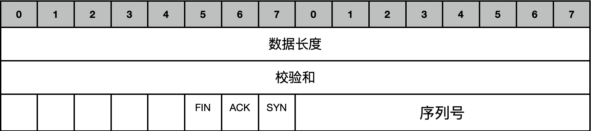
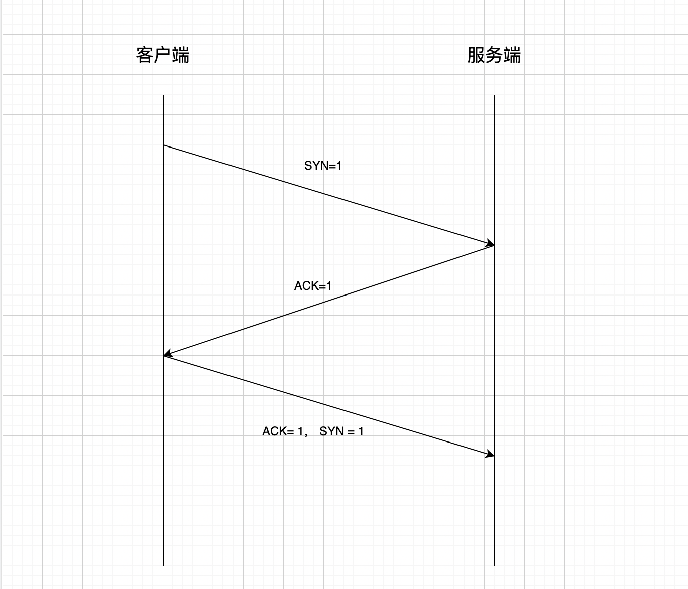
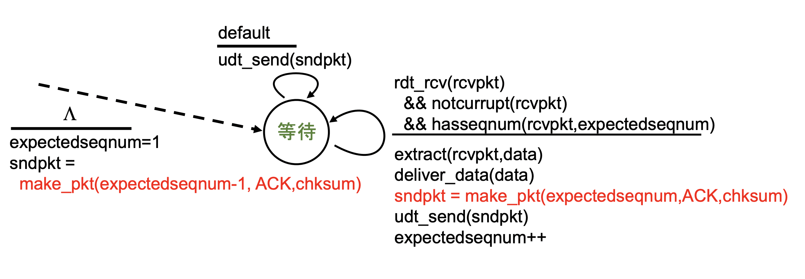
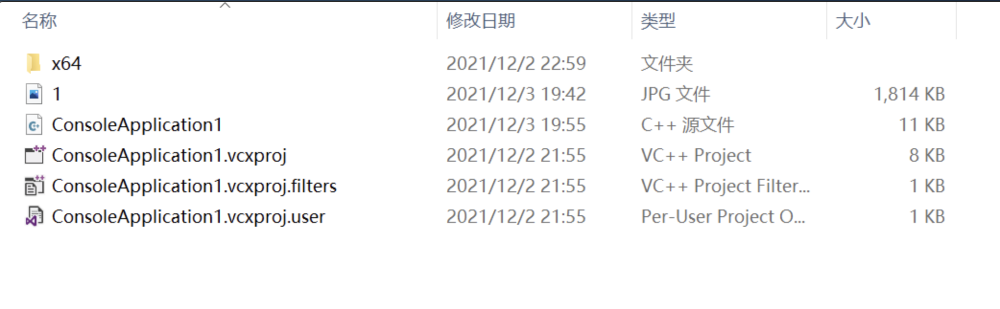

# 计算机网络大作业第二部分

> 朱浩泽 计算机科学与技术 1911530

## 实验要求

在实验3-1的基础上，将停等机制改成基于滑动窗口的流量控制机制，采用固定窗口大小，支持累积确认，完成给定测试文件的传输。

## 实验设计

### 实验原理

##### 1. UDP

UDP是User Datagram Protocol的简称,中文名是用户数据报协议,是OSI参考模型中的传输层协议,它是一种无连接的传输层协议,提供面向事务的简单不可靠信息传送服务。

##### 2. 流水线协议

在确认未返回之前允许发送多个分组

##### 3. 滑动窗口

滑动窗口(Sliding window)是一种流量控制技术。如果网络通信中，通信双方不会考虑网络的拥挤情况直 接发送数据，由于大家不知道网络拥塞状况，同时发送数据，则会导致中间节点阻塞掉包，谁也发不了数据， 所以就有了滑动窗口机制来解决此问题。 TCP中采用滑动窗口来进行传输控制，滑动窗口的大小意味着接收方还有多大的缓冲区可以用于接收数据。发 送方可以通过滑动窗口的大小来确定应该发送多少字节的数据。当滑动窗口为0时，发送方一般不能再发送数据报，但有两种情况除外，一种情况是可以发送紧急数据，例如，允许用户终止在远端机上的运行进程。另一种情况是发送方可以发送一个1字节的数据报来通知接收方重新声明它希望接收的下一字节及发送方的滑动窗口大小。

##### 4. 累计确认

停等协议虽然编写简单，效果稳定，但是其效率比较低，实际中很难利用其进行大量的数据包发送，所以一般情况下，采用流水线的方式进行数据包的发送和接收。Go-Back-N协议采用累积确认的方式，GBN的关键是发 送方能够在收到确认之前发送多个分组,但接收方只能缓存一个分组。发送方为发送出去的分组保留副本，直到来自接收方确认达到。

### 协议设计

##### 1. 报文格式



报文头长度为48位

前16位为数据长度，用于记录数据区的大小

17-32位为校验和，用于检验传输的正确性

33-40位为标志位，只使用低3位，分别为FIN，ACK，SYN

40-48位为传输的数据包的序号，0-255循环使用

##### 2. 滑动窗口

窗口结构如下


窗口分为左边界、发送边界和右边界，窗口大小固定。窗口左边界左侧为已经发送并得到确认的数据，左边界到发送边界的数据为已发送但未得到确认的数据，发送边界到右边界为等待发送的数据，右边界右侧为不可发送的数据。

##### 3. 连接与断开

- 三次握手进行连接

  首先，客户端向服务端发送数据包，其中SYN=1，ACK=0，FIN=0

  服务端接受到数据包后，向客户端发送SYN=0，ACK=1，FIN=0

  客户端再次接收到数据包后，向服务端发送SYN=1，ACK=1，FIN=0

  服务端接收到数据包后，连接成功建立，可以进行数据传输

- 四次挥手断开连接

  首先，客户端向服务端发送数据包，其中SYN=0，ACK=0，FIN=1

  服务端接受到数据包后，向客户端发送SYN=0，ACK=1，FIN=0

  客户端再次接收到数据包后，向服务端发送SYN=0，ACK=1，FIN=1

  服务端接收到数据包后，向客户端发送SYN=0，ACK=1，FIN=1

  客户端接收到数据包后，连接成功断开

##### 4. 数据传输

发送端和接收端的接收机均采用GBN



数据在传输时，将一个文件分为数个包进行分段传输，每个包的内容为数据头+数据

在传输时，无需接受到上一个发送包序号的ACK=1才能发送下一个数据包，可以继续发送直到窗口大小数量的数据包；接收端接收到了一个数据包，先要进行校验，如果检查无误，则向发送放返回该序列号的ACK=1

在一定时间内，如果没有收到某一已经传输的报文的正确的ACK，则将窗口中所有位于改数据包后已经传输但未得到确认的数据包丢弃，并从该数据包开始进行重传，如果再次接收到了已经确认的报文的ACK，则忽略

如果接收端收到了重复的包裹，则将其中一个丢弃，但仍需要向发送方发送该序列号的ACK=1

在最后，发送方需要向接收端发送一个FIN=1， ACK=1，SYN=1的包裹，表示文件传输结束；接收端收到该包裹后，需要向发送方返回一个ACK=1，表示收到文件传输结束的信号。

## 核心代码实现（其余与实验一相同）

### 数据头和标志位定义

```c++
const int MAXSIZE = 1024;//传输缓冲区最大长度
const unsigned char SYN = 0x1; //SYN = 1 ACK = 0
const unsigned char ACK = 0x2;//SYN = 0, ACK = 1
const unsigned char ACK_SYN = 0x3;//SYN = 1, ACK = 1
const unsigned char FIN = 0x4;//FIN = 1 ACK = 0
const unsigned char FIN_ACK = 0x5;//FIN = 1 ACK = 0
const unsigned char OVER = 0x7;//结束标志
double MAX_TIME = 0.5 * CLOCKS_PER_SEC;
int windows = 10; //窗口大小

struct HEADER
{
    u_short sum = 0;//校验和 16位
    u_short datasize = 0;//所包含数据长度 16位
    unsigned char flag = 0;
    //八位，使用后三位，排列是FIN ACK SYN 
    unsigned char SEQ = 0;
    //八位，传输的序列号，0~255，超过后mod
    HEADER() {
        sum = 0;//校验和 16位
        datasize = 0;//所包含数据长度 16位
        flag = 0;
        //八位，使用后三位，排列是FIN ACK SYN 
        SEQ = 0;
    }
};
```

### 传输数据（核心代码）

- 发送单个数据包

  ```c++
  void send_package(SOCKET& socketClient, SOCKADDR_IN& servAddr, int& servAddrlen, char* message, int len, int order)
  {
      HEADER header;
      char* buffer = new char[MAXSIZE + sizeof(header)];
      header.datasize = len;
      header.SEQ = unsigned char(order);//序列号
      memcpy(buffer, &header, sizeof(header));
      memcpy(buffer + sizeof(header), message, sizeof(header) + len);
      u_short check = cksum((u_short*)buffer, sizeof(header) + len);//计算校验和
      header.sum = check;
      memcpy(buffer, &header, sizeof(header));
      sendto(socketClient, buffer, len + sizeof(header), 0, (sockaddr*)&servAddr, servAddrlen);//发送
      cout << "Send message " << len << " bytes!" << " flag:" << int(header.flag) << " SEQ:" << int(header.SEQ) << " SUM:" << int(header.sum) << endl;
  }
  ```
  
- 发送文件以及结束标志

  ```c++
  void send(SOCKET& socketClient, SOCKADDR_IN& servAddr, int& servAddrlen, char* message, int len)
  {
      HEADER header;
      char* Buffer = new char[sizeof(header)];
      int packagenum = len / MAXSIZE + (len % MAXSIZE != 0);
      int head = -1;//缓冲区头部，前方为已经被确认的报文
      int tail = 0;//缓冲区尾部
      int index = 0;
      clock_t start;
      cout << packagenum << endl;
      while(head < packagenum - 1)
      {
          if (tail - head < windows && tail != packagenum)
          {
              //cout << message + tail * MAXSIZE << endl;
              send_package(socketClient, servAddr, servAddrlen, message + tail * MAXSIZE, tail == packagenum - 1 ? len - (packagenum - 1) * MAXSIZE : MAXSIZE, tail % 256);
              start = clock();//记录发送时间
              tail++;
          }
  
          //变为非阻塞模式
          u_long mode = 1;
          ioctlsocket(socketClient, FIONBIO, &mode);
          if(recvfrom(socketClient, Buffer, MAXSIZE, 0, (sockaddr*)&servAddr, &servAddrlen))
          {
              //cout << seqnum<<" " <<package_send << endl;
              memcpy(&header, Buffer, sizeof(header));//缓冲区接收到信息，读取
              u_short check = cksum((u_short*)&header, sizeof(header));
              if (int(check) != 0 || header.flag != ACK)
              {
                  tail = head + 1;
                  cout << " hah" << endl;
                  continue;
              }
              else
              {
                  if (int(header.SEQ) >= head % 256)
                  {
                      head = head + int(header.SEQ) - head % 256;
                      cout << "Send has been confirmed! Flag:" << int(header.flag) << " SEQ:" << int(header.SEQ) << endl;
                  }
                  else if (head % 256 > 256 - windows - 1 && int(header.SEQ) < windows)
                  {
                      head = head + 256 - head % 256 + int(header.SEQ);
                      cout << "Send has been confirmed! Flag:" << int(header.flag) << " SEQ:" << int(header.SEQ) << endl;
                  }
              }
          }
          else 
          {
              if(clock() - start > MAX_TIME) 
              {
                  tail = head + 1;
                  cout << "Re";
              }
          }
          mode = 0;
          ioctlsocket(socketClient, FIONBIO, &mode);
      }
  
      //发送结束信息
      header.flag = OVER;
      header.sum = 0;
      u_short temp = cksum((u_short*)&header, sizeof(header));
      header.sum = temp;
      memcpy(Buffer, &header, sizeof(header));
      sendto(socketClient, Buffer, sizeof(header), 0, (sockaddr*)&servAddr, servAddrlen);
      cout << "Send End!" << endl;
      start = clock();
      while (1 == 1)
      {
          u_long mode = 1;
          ioctlsocket(socketClient, FIONBIO, &mode);
          while (recvfrom(socketClient, Buffer, MAXSIZE, 0, (sockaddr*)&servAddr, &servAddrlen) <= 0)
          {
              if (clock() - start > MAX_TIME)
              {
                  char* Buffer = new char[sizeof(header)];
                  header.flag = OVER;
                  header.sum = 0;
                  u_short temp = cksum((u_short*)&header, sizeof(header));
                  header.sum = temp;
                  memcpy(Buffer, &header, sizeof(header));
                  sendto(socketClient, Buffer, sizeof(header), 0, (sockaddr*)&servAddr, servAddrlen);
                  cout << "Time Out! ReSend End!" << endl;
                  start = clock();
              }
          }
          memcpy(&header, Buffer, sizeof(header));//缓冲区接收到信息，读取
          u_short check = cksum((u_short*)&header, sizeof(header));
          if (header.flag == OVER)
          {
              cout << "对方已成功接收文件!" << endl;
              break;
          }
          else
          {
              continue;
          }
      }
      u_long mode = 0;
      ioctlsocket(socketClient, FIONBIO, &mode);//改回阻塞模式
  }
  ```

### 接收数据

```c++
int RecvMessage(SOCKET& sockServ, SOCKADDR_IN& ClientAddr, int& ClientAddrLen, char *message)
{
    long int all = 0;//文件长度
    HEADER header;
    char* Buffer = new char[MAXSIZE + sizeof(header)];
    int seq = 0;
    int index = 0;

    while (1 == 1)
    {
        int length = recvfrom(sockServ, Buffer, sizeof(header) + MAXSIZE, 0, (sockaddr*)&ClientAddr, &ClientAddrLen);//接收报文长度
        //cout << length << endl;
        memcpy(&header, Buffer, sizeof(header));
        //判断是否是结束
        if (header.flag == OVER && cksum((u_short*)&header, sizeof(header)) == 0)
        {
            cout << "文件接收完毕" << endl;
            break;
        }
        if (header.flag == unsigned char(0) && cksum((u_short*)Buffer, length - sizeof(header)))
        {
            //判断是否接受的是别的包
            if (seq != int(header.SEQ))
            {
                //说明出了问题，返回ACK
                header.flag = ACK;
                header.datasize = 0;
                header.SEQ = (unsigned char)seq;
                header.sum = 0;
                u_short temp = cksum((u_short*)&header, sizeof(header));
                header.sum = temp;
                memcpy(Buffer, &header, sizeof(header));
                //重发该包的ACK
                sendto(sockServ, Buffer, sizeof(header), 0, (sockaddr*)&ClientAddr, ClientAddrLen);
                cout << "Send to Clinet ACK:" << (int)header.SEQ << " SEQ:" << (int)header.SEQ << endl;
                continue;//丢弃该数据包
            }
            seq = int(header.SEQ);
            if (seq > 255)
            {
                seq = seq - 256;
            }
            //取出buffer中的内容
            cout << "Send message " << length - sizeof(header) << " bytes!Flag:" << int(header.flag) << " SEQ : " << int(header.SEQ) << " SUM:" << int(header.sum) << endl;
            char* temp = new char[length - sizeof(header)];
            memcpy(temp, Buffer + sizeof(header), length - sizeof(header));
            //cout << "size" << sizeof(message) << endl;
            memcpy(message + all, temp, length - sizeof(header));
            all = all + int(header.datasize);

            //返回ACK
            header.flag = ACK;
            header.datasize = 0;
            header.SEQ = (unsigned char)seq;
            header.sum = 0;
            u_short temp1 = cksum((u_short*)&header, sizeof(header));
            header.sum = temp1;
            memcpy(Buffer, &header, sizeof(header));
            Sleep(0.003 * 1000);//暂停一下，模拟其传输延迟
            sendto(sockServ, Buffer, sizeof(header), 0, (sockaddr*)&ClientAddr, ClientAddrLen);
            cout << "Send to Clinet ACK:" << (int)header.SEQ << " SEQ:" << (int)header.SEQ << endl;
            seq++;
            if (seq > 255)
            {
                seq = seq - 256;
            }
        }
    }
    //发送OVER信息
    header.flag = OVER;
    header.sum = 0;
    u_short temp = cksum((u_short*)&header, sizeof(header));
    header.sum = temp;
    memcpy(Buffer, &header, sizeof(header));
    if (sendto(sockServ, Buffer, sizeof(header), 0, (sockaddr*)&ClientAddr, ClientAddrLen) == -1)
    {
        return -1;
    }
    return all;
}
```

## 实验结果展示

### 三次挥手建立连接


### 传输数据和断开连接


可以看出，虽然加入了延时停顿，但利用滑动窗口的流量控制机制的方式，传输效率时间与实验一相似，说明用该机制效率远超于实验一。

### 传输结果展示




与原图大小、信息完全相同，传输成功！


